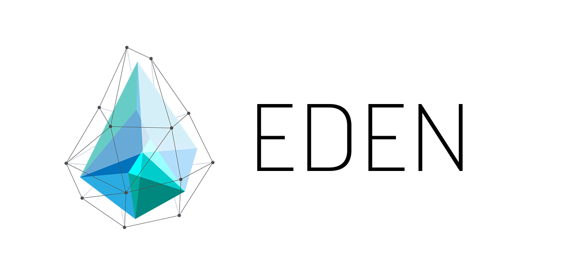

## Introduction Eden

Introducing Eden a new digital currency that enables anonymous, instant
payments to anyone, anywhere in the world. Eden uses peer-to-peer technology
to operate with no central authority: managing transactions and issuing money
are carried out collectively by the network.

X16S Whitepaper: https://mega.nz/#!ZEF3lKTC!C6-eOfPTVfhxIyoT_r8yHbz5OmuU_UL8aVo6izFh0R0 
__________________________________________________________________________
### Eden Specifications

###### Current Version: 1.0.0.1 (Revolt)
###### PoW Algorithm: X16S
###### Block Max Size: 6 MB
###### Block Time: ~60 seconds
###### Premine: 5%
###### Maturity: 125 blocks
###### Max Supply: 14000000 EDEN
###### Difficulty Algorithm: Zawy DigiShield
###### RPC Port: 3594
###### P2P Port: 3595
###### Masternodes Collateral: 2500 EDEN
###### Masternode Reward: 40% of block after block 12000
__________________________________________________________________________